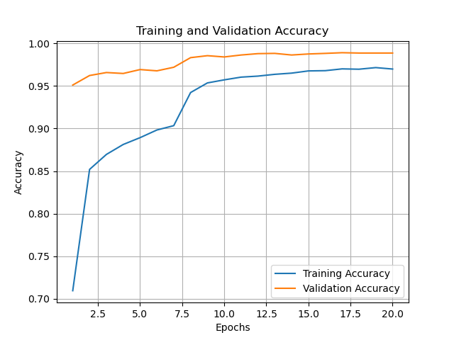

# Bird Classification with ResNet34 and ViT using PyTorch
This project aims to classify bird species based on images using two popular deep learning models: ResNet34 and ViT (Vision Transformer). The dataset used in this project comes from [Kaggle's Birds Classification](https://www.kaggle.com/datasets/gpiosenka/100-bird-species) .
# Requirements
- Python 3.6+
- PyTorch 1.9+
- Torchvision 0.10+
- NumPy
- Matplotlib
- Pillow
- tqdm
# Dataset
 There are 82724 training images, 2575 test images (5 per species), and 2575 validation images (5 per species). This is a very high-quality dataset with only one bird in each shot, and the bird typically occupies at least 50$\%$ of the image's pixels. All pictures are 224 * 224 * 3 colour jpg files. There are three types of data sets: training, testing, and validation. There are 515 subdirectories total in each set, one for every type of bird.

# Models   
This project uses two deep learning models to classify bird species:

- ResNet34: a convolutional neural network architecture that has been pre-trained on the ImageNet dataset. We will fine-tune the last few layers of this model on our bird dataset.

- ViT: a transformer-based architecture that has been proposed for image classification. This model does not require pre-training on ImageNet and can be trained directly on our bird dataset.

# Training 
Before run the train, please download the dataset under project folder and change the directory to your local directory.\
The structure should like this
```
├──  src
│    └── model.py
│    └── test.py
│    └── train_vit.py
│    └── train.py
├──  configs  
│    └── bird.csv
│    └── test.csv
│    └── valid.csv
│    └── class_indices.json

```
Train resnet34:

```bash
 python train.py
```
Train ViT

```bash
 python train_vit.py
```

# Results

| Model  |     Validation Accuracy|
|----------|:-------------:|
| ResNet34|  96.9% |
| ViT |    98.91%  |  


Results for ResNet34\

\

Results for ViT\



